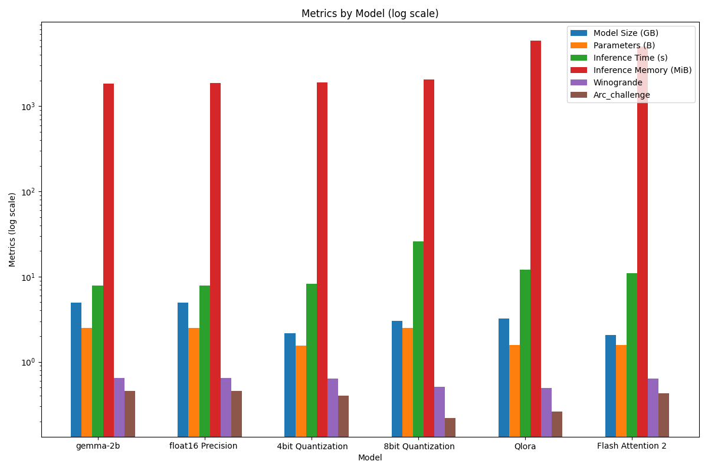

# High Performance Machine Leanrning COMS-E6998

## Analysis and Performance Optimization of Gemma

Developed by the Google Deepmind team, Gemma is an open source, lightweight, state-of-the-art, pre-trained language model designed for generative AI and built in parallel with Google’s Gemini models. However, despite their remarkable capabilities, LLMs like Gemma come with inherent computational demands that raise concerns regarding efficiency and environmental impact. Advancements in gpu cloud computing and open source models have further pushed the optimization of Gemma which fosters inclusivity and accessibility in AI. By minimizing resource requirements, researchers can lower the barrier to entry for utilizing Gemma, enabling a broader range of individuals and organizations to leverage its capabilities. This democratization of AI empowers diverse communities to participate in and benefit from the advancements facilitated by LLMs. This repo explores the process of optimizing Gemma inference. 

## Outline
- gemma_q8bit.ipynb
- gemma_qbit4.ipynb
- gemma_single_gpu.ipynb
- gemma_single_gpu_float16.ipynb
- lora.ipynb
- flash_attention_2
- metrics.ipynb

## Setup
+ conda
+ python > 3.10
+ CUDA Version > 12.0

Commands to execute the code    

    $ conda create --name <venv_name> --file requirements.txt
    $ conda activate <venv_name>

    #To run individual script
    $ python <script_name>.py 

## Results 

### Observations  
This experiment was conducted on the NVIDIA L4 GPU (Ada Lovelace architecture) through google colab and through a gcp instance with the same setup. Due to RAM contraints, and the increasing difficulty to obatin a GPU, the Google/Gemma-2B model was used which has a smaller footprint. Efforts in optimizing the inference of gemma proved to be successful to a certain extent. Despite the quantization and reduced precision efforts, the results were still comparably accurate with the original model. Furthermore, efforts in fine tuning machine prompt task yield comparable accuracy with using the Flash Attention and Qlora methods as the bar chart above shows. 
